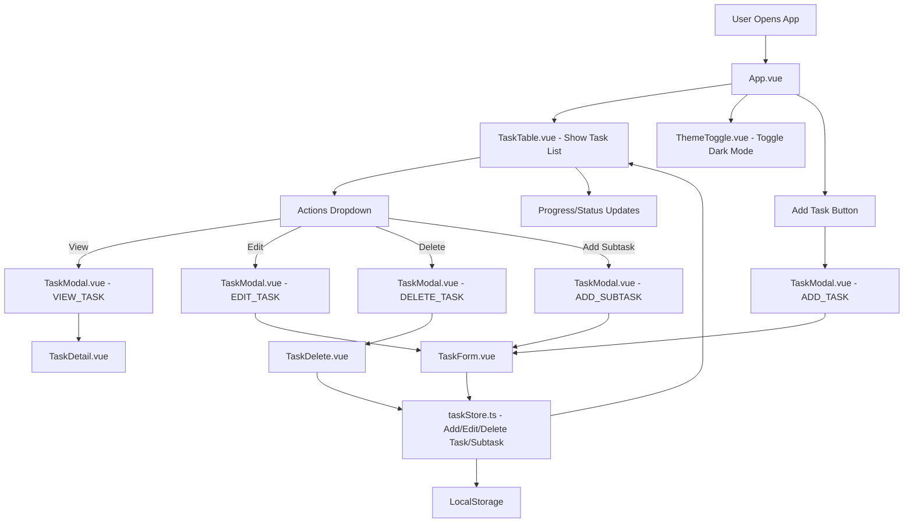

# ToDoApp – Vue 3 + Vite + Nuxt UI 3

This project is a starter template for building modern web applications using **Vue 3**, **Vite**, **TypeScript**, and [Nuxt UI 3](https://ui.nuxt.com). It is set up for rapid development with a focus on best practices and developer experience.

## Features

- **Vue 3**: Progressive JavaScript framework for building user interfaces.
- **Vite**: Fast, next-generation frontend tooling.
- **TypeScript**: Type-safe development.
- **Nuxt UI 3**: Beautiful, customizable UI components.
- **ESLint & Prettier**: Code quality and formatting.
- **Tailwind CSS**: Utility-first CSS framework (with Prettier plugin).
- **Auto Imports**: Common composables and utilities are auto-imported for convenience.

## Application Flow



## Application Functionality

This section describes the user flow and component interactions within the ToDoApp, as illustrated in the application flow diagram.

1.  **Initialization**:
    *   When a user opens the application, the main `App.vue` component is loaded.
    *   `App.vue` renders the primary user interface, including the `TaskTable.vue` component (which displays the list of tasks) and the `ThemeToggle.vue` component (allowing the user to switch between light and dark modes).

2.  **Adding a New Task**:
    *   The user clicks the "Add Task" button.
    *   This action triggers the display of `TaskModal.vue` configured for adding a task.
    *   Inside the modal, the `TaskForm.vue` is presented for the user to input task details.
    *   Upon submission, the `TaskForm.vue` sends the data to `taskStore.ts` .
    *   `taskStore.ts` processes the request to add the new task, updates the application state, persists the changes to `LocalStorage`, and notifies `TaskTable.vue` to refresh the displayed list.

3.  **Managing Existing Tasks (via Actions Dropdown)**:
    *   Within the `TaskTable.vue` , each task has an associated "Actions Dropdown".
    *   This dropdown provides several options:
        *   **View**: Opens `TaskModal.vue`, which then displays the `TaskDetail.vue` component showing the selected task's full information.
        *   **Edit**: Opens `TaskModal.vue`, presenting `TaskForm.vue` pre-filled with the task's current data. After editing and submission, `taskStore.ts` handles the update, saves to `LocalStorage`, and refreshes the `TaskTable.vue` .
        *   **Delete**: Opens `TaskModal.vue`, showing the `TaskDelete.vue` component for confirmation. If confirmed, `taskStore.ts` removes the task, updates `LocalStorage`, and refreshes the `TaskTable.vue` .
        *   **Add Subtask**: Opens `TaskModal.vue`, again using `TaskForm.vue` to create a new task linked as a subtask to the selected parent. Submission follows the standard add process via `taskStore.ts`, `LocalStorage`, and updating `TaskTable.vue` .

4.  **State Management and Persistence**:
    *   All core task operations (add, edit, delete, subtask management) are handled centrally by `taskStore.ts`.
    *   `taskStore.ts` is responsible for managing the application's task data state.
    *   It interacts with `LocalStorage` to ensure task data persists across browser sessions.
    *   Changes managed by the store trigger reactivity, updating components like `TaskTable.vue` .

5.  **User Feedback**:
    *   The `TaskTable.vue`  reflects real-time updates, including changes to task progress or status, providing immediate feedback to the user after any operation.


## Getting Started

1. **Install dependencies**  
   ```bash
   bun install
   ```

2. **Run the development server**  
   ```bash
   bun dev
   ```

3. **Build for production**  
   ```bash
   bun build
   ```

4. **Preview production build**  
   ```bash
   bun preview
   ```

## Docker

You can build and run this app using Docker.  
Make sure you have [Docker](https://docs.docker.com/get-docker/) installed.

### Build the Docker image

```bash
docker build -t todoapp .
```

### Run the Docker container

```bash
docker run -p 8080:8080 todoapp
```

The app will be available at [http://localhost:8080](http://localhost:8080).


## Recommended IDE Setup

- [VS Code](https://code.visualstudio.com/)
- [Volar](https://marketplace.visualstudio.com/items?itemName=Vue.volar) (disable Vetur)
- [TypeScript Vue Plugin (Volar)](https://marketplace.visualstudio.com/items?itemName=Vue.vscode-typescript-vue-plugin)

## TypeScript & Vue

TypeScript does not natively understand `.vue` files. This template uses `vue-tsc` for type checking.  
For best experience, use Volar’s Take Over Mode:

1. Disable the built-in TypeScript Extension:
   - Run `Extensions: Show Built-in Extensions` in VS Code.
   - Find `TypeScript and JavaScript Language Features`, right-click, and select `Disable (Workspace)`.
2. Reload the window (`Developer: Reload Window`).


## Additional Notes

- Uses [Bun](https://bun.sh/) as the package manager.
- Lockfile maintenance and dependency updates are managed by Renovate.

---

For more details, see the [Nuxt UI documentation](https://ui.nuxt.com) and [Vite documentation](https://vitejs.dev/).